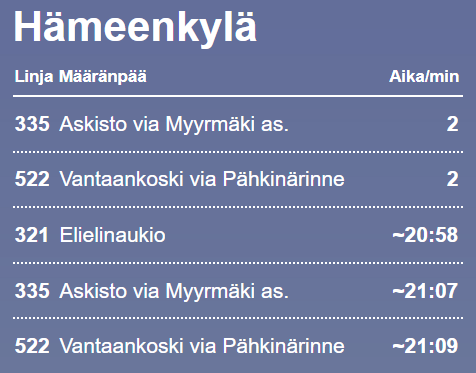

# 🚌 HSL Departure Card for Home Assistant

This custom card displays upcoming HSL (Helsinki Region Transport) departures using a specified `sensor` in a clean, HSL(ish) style layout.

## 🔧 Features

- Uses any sensor with a `departures` attribute from [Digitransit Custom Component](https://github.com/Mallonbacka/custom-component-digitransit)
- Displays 5 next departures.

## 📦 Installation

**Installing using HACS (recommended):**

1. **Add the custom card using HACS**


   Click the three-dot menu (⋮) in the top-right corner of the HACS Frontend screen

   Choose “Custom repositories”

   - **Repository:** /local/hsl-departure-card.js
   - **Type:** Dashboard


   Click Add.

2. **Install the Card**

   After adding the custom repository, you should see it in the list

   Click the card and press Download

3. **Reload your browser** (clear cache)


#
**Manual installing method:**


1. **Save the JavaScript file**

   Save the hsl-departure-card.js file to your Home Assistant public folder:
   ```
   /config/www/hsl-departure-card.js
   ```

2. **Add it to your resources**

   In Home Assistant, go to:

   **Settings → Dashboards → Resources tab**  
   Click **Add Resource** and fill in:

   - **URL**: `/local/hsl-departure-card.js`
   - **Type**: `JavaScript Module`

3. **Reload your browser** (clear cache).

## 🧾 YAML Configuration

Example dashboard YAML to add the card (minimium):

```yaml
type: custom:hsl-departure-card
entity: sensor.kamppi_h1248_next_departure
```

Replace the `entity` with the name of your actual sensor.

| Name     | Type   | Required | Description                                          |
| -------- | ------ | -------- | ---------------------------------------------------- |
| `type`   | string | **Yes**  | Must be `'custom:hsl-departure-card'`                |
| `entity` | string | **Yes**  | The entity ID of the sensor providing departure data |
| `title`  | string | No       | Optional title to display at the top of the card     |


## 🔍 Requirements

You must have [Digitransit Custom Component](https://github.com/Mallonbacka/custom-component-digitransit) installed.

## 🖼️ Example



## 👏 Credits

Credits to [@Mallonbacka](https://github.com/Mallonbacka) for awesome [Digitransit Custom Component](https://github.com/Mallonbacka/custom-component-digitransit)
